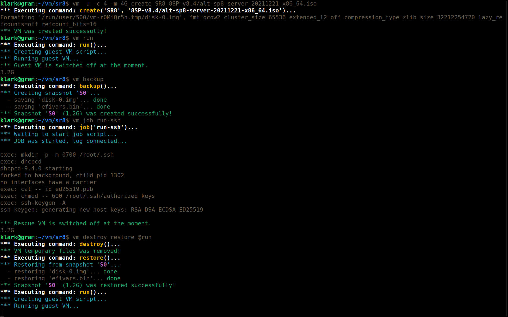

# VM

VM is a simple set of scripts for myself that can be used to automate
the startup and deployment of virtual machines. It is just a wrapper
over the qemu command line.

## Requires

- `qemu-system-*` binary for your platform.
- `qemu-img` binary for creating initial HDD's.
- `pigz` and `unpigz` binaries for snapshoting.
- `remote-viewer` binary (optional) for working with guest VM.
- `bash` on host and `sh` inside Rescue VM for executing jobs.

## Features

- Creating, saving, restoring and destroying VM's.
- Many useful defaults for your VM's already set.
- Execution jobs-scripts inside ALT Rescue VM.
- Using color console and ability to tune colors.
- Optional using external media for store big data.
- Running on local computer with the graphics card.
- Running on remote server. SPICE can use in any case.
- Creating working files in place and in the `$TMPDIR` (default).

## Preparing working space

- Copy scripts from `bin` to your binary directory and make it executable.
  You can modify this scripts as needed.
- Create sub-directory `vm` in your home directory and copy `scripts`
  sub-directory to.
- Prepare special rescue ISO-image for execution jobs inside ALT Rescue.
- Copy following lines to your `~/.ssh/config`:

```
Host    kvm
        Hostname 127.0.0.1
        NoHostAuthenticationForLocalhost yes
        IdentityFile ~/.ssh/id_ed25519
        Port 5555
        User root
```

## Preparing special rescue ISO-image

```bash
$ mkdir -p -m 755 ~/tmp/stage3
$ cp -Lf ~/vm/scripts/rescue-stage3 ~/tmp/stage3/autorun
$ alt2deploy -r ~/tmp/stage3 alt-p10-rescue-latest-x86_64.iso rescue-p10-x86_64.iso
$ rm -rf ~/tmp/stage3
```

## Changing the defaults

- `/etc/vm.conf` - global settings for all users, they override the defaults.
- `~/.config/vm.conf` - user personal setting, they also override the global
  settings for all users.
- `vm.defaults` - additional qemu arguments: this file can be placed in
  the `/etc`, `~/.config`, `$HOSTDIR` or `$WORKDIR` directories (see
  `vm-cmd-run.sh` to get more details.

## Creating snapshots

You can take as many snapshots as needed. The snapshot can be given an
arbitrary name. You can add a short description to the snapshot. By default,
snapshots are automatically named as `S0`, `S1`, `S2`, etc... The symlink
`LAST` points to the last snapshot taken.

## Restoring from a snapshot

The `vm restore` command allows you to restore the working state of
the VM from the last snapshot taken. To restore from another snapshot,
you should specify its name, ex.: `vm restore 2023-05-10`. If no working
files are found when the VM starts up, a restore from the latest snapshot
is automatically started.

## Jobs

A job is an arbitrary set of files, one, two or three scripts, of which
only script `.job` is required. Job scripts can be located in two places:
in the VM directory and in the general location for storing them:
`$LIBEXEC/jobs`. The rest of the files for a guest can be anywhere.

Usually script `.pre` copies everything needed to `$WORKDIR/.in/`, script
`.job` is copied there too. After the job has completed and the virtual
machine has shut down, the script `.post` will be run, if available.

Inside rescue VM you can use following mounted directories:

- `/tmp/.mirror` (optional, read only) - repositories mirror.
- `/tmp/.in` (read only) - for reading input data for the job.
- `/tmp/.out` (full access) - for saving job results and logs.

Inside `<JOBNAME>.pre` and `<JOBNAME>.post` scripts you can use
all variables which declared in `vm-main.sh`. Most useful are:

- `$HOSTDIR` - primary directory with VM snapshots and settings.
- `$WORKDIR` - temporary directory with working files of the VM.
  It may be same as `$HOSTDIR` only when program running with the
  option `--inplace`, but by default working files created on the
  runfs or tmpfs.
- `$LIBEXEC` - directory with this utility scripts such as `vm-main.sh`.

Script `<JOBNAME>.job` running inside special rescue VM. It can use
following variables:

- `$MIRROR` - repositories mirror (optional, read only).
- `$INDIR` - path to input data from the host system (read only).
- `$OUTDIR` - directory for saving results and logs (full access).
- `$MNTOPTS` - 9p-shares mount options for data exchange between
  host and guest systems.

### add-ssh-keys job

This job copies all existing public SSH-keys, as specified by the `$SSHKEYS`
variable, to the guest VM and adds each SSH-key for the superuser inside the
installed guest OS. After completing this job you can login to the guest VM
without a password prompt as superuser.

### run-ssh job

This job also adds SSH-keys, but not to the installed system, but to a
specialized rescue system, after which it raises the network in this rescue
system, generates host keys and starts the SSH service. This allows further
jobs to be executed via ssh immediately, no need to wait for the VM to start.
To shut down a VM in a SSH-session, just remove the `$WORKDIR/.out/RELEASE`
file and disconnect.

### post-install job

Allows you to perform certain work after installing the OS:

- on the host system in your `post-install.pre` script and also copying
  the files to `$INDIR`;
- in ALT Rescue guest system with `post-install.sh` script;
- in the chroot of the installed OS from the same script;
- again on the host system in your `post-install.post` script.

The results are output to the terminal of the host system during the
execution of all scripts inside ALT Rescue and are written to the
`$OUTDIR/job.log` log. A typical usage is to have only one set of files
in the virtual machine directory (`$HOSTDIR`) to run this job with the
following default names:

- `post-install.sh` is the only required file for this job. Note that its
   name is determined by the `$SETUP_SCRIPT` variable, which can be changed
   through the passed set of parameters, or by the `$SETUP_PROFILE` variable,
   which can be exported through the environment when the command is run;
- `post-install.env` (optional) - a set of parameters passed to all executable
  scripts. There can be any arbitrary data, not just those described below;
- `post-install.pre` (optional) - executed on the host system before starting
  the main part of the job and can be used, for example, to check the
  possibility of its execution;
- `post-install.post` (optional) - executed on the host system after the
  completion of the main part of the task and can be used, for example,
  to process the results of the job;
- `post-install.host-$SETUP_HOSTNAME.tgz` (optional) - archive, usually
  unpacked by your script to the root of the installed OS. It is automatically
  copied to `$INDIR` if present and if `$SETUP_HOSTNAME` is set;
- `post-install.user-$SETUP_USERNAME.tgz` (optional) - archive, usually
  unpacked by your script to the user's home directory in the installed OS.
  It is automatically copied to `$INDIR` if present.

Note that there should not be a script named `post-install.job` in the
`$HOSTDIR` directory, since it is already in `$LIBEXEC/jobs` and preparing
your job, in particular, it mounts everything the necessary directories of
the installed OS, so that in the future it would be easier to do chroot
into it. There is no need to make files executable.

The `post-install` job can be run multiple times on the same virtual machine
with a different set of files and parameters. To change the default values,
export the `$SETUP_PROFILE` variable to the environment. The `post-install`
job additionally defines the following parameters:

- `$SETUP_PROFILE` - Setup profile name. It is transmitted only through the
  environment. All of the files listed above begin with this name. Default
  is: "post-install".
- `$SETUP_VERBOSE` - Non-empty if the job in the ALT Rescue chroot should
  be run with debug information (`set -x`). Debugging is also enabled if
  the `$INDIR/DEBUG` file is present.
- `$SETUP_ROOTDEV` - Root partition of the installed OS, eg "/dev/sda3"
  or "LABEL=SYSTEM". If not specified, the `mount-system` command is used
  to automatically mount the directories of the installed OS.
- `$SETUP_SCRIPT` - The included script of the your job. By default, it's
  defined by the profile name with the addition of the ".sh" suffix.
- `$SETUP_HOSTNAME` - The name of the host with the installed OS, if it
  needs to be changed after installation, or to determine the name of an
  archive with files for unpack to the root of the installed OS.
- `$SETUP_USERNAME` - The name of the user in the installed OS to manipulate
  his profile. By default, the username is taken from the host OS.
- `$SETUP_USER_UID` - UID of the user in the installed OS for manipulating
  his profile. By default, the user's UID is taken from the host OS.
- `$SETUP_FILES` (array) - A list of files (relative to `$HOSTDIR` or with
  absolute paths) that need to be additionally copied to `$INDIR` before
  the job is executed.
- `$DESTDIR` - Directory with installed OS, for example, "/mnt/system1".
  Usually it is detected and mounted automatically, but if you need to
  perform these actions in your script in a different way, write your
  own non-empty value to this variable.

You can define any other parameters, for example:

- `$SETUP_PASSWORD` - Password of the regular user, if you need to
  change it after OS installation.
- `$SETUP_ROOT_PWD` - Administrator (root) password, if you need to
  change it after OS installation.
- `$SETUP_TIMEZONE` - Time zone, if you need to change it after OS
  installation.

You can use the following standard functions in your job script:

- `fatal()` - Displays an error message and crashes.
- `run()` - Performs the specified action and logs it.

## Usage examples

`vm -c 8 -m 4G @create WS10 /iso/image.iso @job prepare @run @backup`

VM files will be created in the current directory with the following
parameters: GUESTNAME=WS10, CORES=8, MEMORY=4G, BOOTIMAGE=/iso/image.iso,
all other by default; then job 'prepare' will be executed inside special
RESCUE VM; then VM will be bootted once from the specified BOOTIMAGE;
and after the VM will be switched off, a snapshot "S0" will be created.

`vm --no-uefi --tmeout=30 @restore S2 @job add-ssh-keys`

VM will be restored from snapshot S2; then job 'add-ssh-keys' will be
executed inside special RESCUE VM: this job has a 30 seconds time limit
for executing from job start, and VM will be started in Legacy/CSM mode,
even if it VM was created with UEFI-boot.



## Getting help

Just run: `vm -h`.

## License

VM is licensed under the GNU General Public License (GPL), version 3,
or (at your option) any later version.
